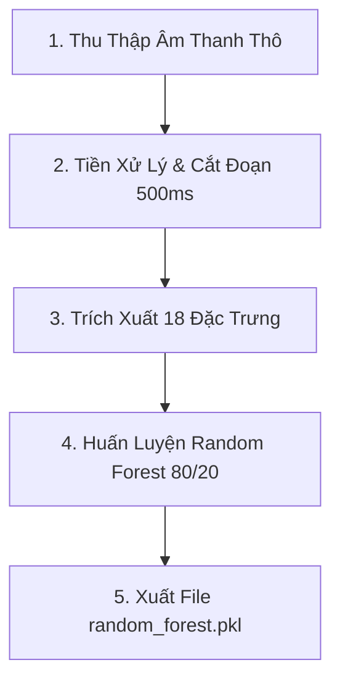

# AI Model Training Guide (Chi Tiết Quy Trình Huấn Luyện Mô Hình AI)

Tài liệu này giải thích chi tiết quy trình xử lý tín hiệu âm thanh và huấn luyện mô hình học máy (Machine Learning Pipeline) của dự án **Durly**, tham chiếu trực tiếp đến file mã nguồn huấn luyện `train_model.py`.

---

## 📊 1. Sơ Đồ Kiến Trúc Pipeline AI



---

## 🛠️ 2. Chi Tiết 4 Giai Đoạn Trong Pipeline

### Giai Đoạn 1: Thu Thập Dữ Liệu (Data Collection)
* Sử dụng microphone thiết bị di động để thu âm tiếng gõ sầu riêng thực tế.
* Các tệp âm thanh thô này được gán nhãn thủ công bởi chuyên gia/thương lái thực tế thành 2 nhóm:
  * **`ripe`**: Quả đã chín (tiếng gõ nghe đục, trầm, vang nhẹ do phần cơm sầu riêng đã tách khỏi vỏ).
  * **`unripe`**: Quả còn non/chưa chín (tiếng gõ nghe đanh, sắc, chói do phần cơm sầu riêng vẫn bám chặt vào vỏ).

---

### Giai Đoạn 2: Tiền Xử Lý & Cắt Đoạn Tự Động (Preprocessing & Segmentation)
Âm thanh thô từ micro chứa nhiều tạp âm nền, do đó cần đi qua bộ tiền xử lý bằng thư viện `librosa` để làm sạch:
1. **Resampling**: Chuyển đổi tần số lấy mẫu (Sample Rate) về chuẩn **`22.05 kHz`** và chuyển về âm thanh đơn kênh (Mono).
2. **Chuẩn hóa biên độ (Amplitude Normalization)**: Đưa mức âm lượng về cùng một dải để tránh việc gõ mạnh hay gõ nhẹ làm ảnh hưởng đến thuật toán.
3. **Phát hiện đỉnh (Peak Detection)**: Sử dụng thuật toán tìm các điểm đạt đỉnh biên độ sóng với ngưỡng **`threshold = 0.15`** để xác định chính xác thời điểm dùi/dao gõ vào vỏ sầu riêng.
4. **Cắt đoạn (Segmentation)**: Cắt tệp âm thanh thành các cửa sổ ngắn cố định có độ dài **`500ms`** xung quanh các đỉnh gõ vừa tìm được.
5. **Lọc nhiễu (Low-Energy Filter)**: Loại bỏ các đoạn 500ms có năng lượng quá thấp (khoảng lặng không có tiếng gõ hoặc tiếng ồn nền).

---

### Giai Đoạn 3: Trích Xuất Đặc Trưng Vật Lý (Feature Extraction)
Mỗi đoạn âm thanh 500ms được biến đổi toán học để trích xuất ra **18 chỉ số đặc trưng số học** (Numerical Feature Vector):
* **Time-Domain Features (Đặc trưng miền thời gian)**:
  * **RMS (Root Mean Square)**: Đo năng lượng/độ lớn của tiếng gõ sầu riêng.
  * **ZCR (Zero Crossing Rate)**: Tốc độ đổi dấu của sóng âm (mô tả tần số dao động).
* **Spectral-Domain Features (Đặc trưng miền tần số)**:
  * **13 hệ số MFCCs (Mel-Frequency Cepstral Coefficients)**: Mô tả hình dạng phổ âm lượng tương tự cách tai người cảm nhận âm thanh.
  * **Spectral Centroid**: Độ "sáng" (tần số trung tâm) của âm thanh.
  * **Spectral Rolloff & Bandwidth**: Các thông số đo độ rộng và điểm giới hạn của dải tần số.
* Toàn bộ 18 đặc trưng này của tất cả các file mẫu được lưu trữ tập trung vào tệp tin **`data/features/features.csv`** kèm theo cột nhãn `label` (ripe/unripe).

---

### Giai Đoạn 4: Huấn Luyện Mô Hình Học Máy (Model Training)
Tại file [train_model.py](file:///d:/Durian_App/DurianDetectionApp/DURIAN_RIPENESS_CLASSIFICATION/src/train_model.py), quá trình huấn luyện sử dụng thư viện **Scikit-learn**:

* **Mô hình sử dụng**: **`RandomForestClassifier`** (Rừng cây quyết định). Đây là mô hình học máy dạng phân loại nhóm, hoạt động bằng cách tổng hợp kết quả bỏ phiếu từ 100 cây quyết định độc lập.
* **Cấu hình mô hình thực tế trong code**:
  ```python
  model = RandomForestClassifier(
      n_estimators=100,         # Dựng 100 cây quyết định độc lập
      max_depth=8,              # Giới hạn chiều cao cây = 8 để CHỐNG QUÁ KHỚP (Overfitting)
      min_samples_split=4,      # Số mẫu tối thiểu để phân tách node con
      min_samples_leaf=2,       # Số mẫu tối thiểu ở node lá
      random_state=42,          # Đảm bảo kết quả huấn luyện không đổi giữa các lần chạy
      class_weight="balanced"   # Tự động cân bằng nếu số lượng mẫu chín và non bị lệch nhau
  )
  ```
* **Phân chia dữ liệu**:
  * Áp dụng tỉ lệ **80% dữ liệu dùng để Huấn luyện (Train)** và **20% dữ liệu dùng để Kiểm thử (Test)** (`test_size=0.2`).
  * Sử dụng thuộc tính `stratify=y` để đảm bảo tỷ lệ số mẫu chín/non ở hai tập Train và Test luôn đồng đều nhau.
* **Đánh giá mô hình**:
  * Sử dụng phương pháp kiểm chứng chéo **`5-fold Cross Validation`** để đánh giá độ ổn định khách quan của mô hình trên toàn bộ tập dữ liệu.
  * Đánh giá chi tiết qua **Confusion Matrix** (Ma trận nhầm lẫn) để kiểm tra các chỉ số lỗi (dương tính giả, âm tính giả).
* **Đóng gói**: Xuất mô hình hoàn thiện ra file nhị phân **`models/random_forest.pkl`** bằng thư viện `joblib` để sẵn sàng nạp lên RAM của FastAPI phục vụ suy luận.
