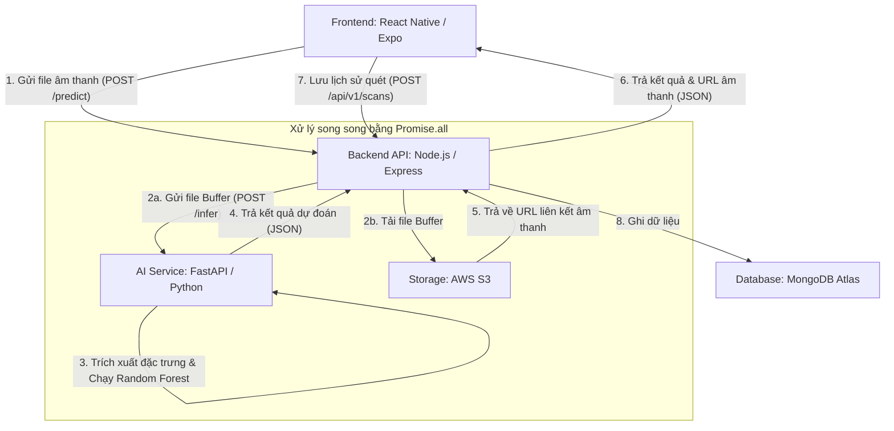

# Durly - Durian Ripeness Detection Application

Ứng dụng di động nhận diện độ chín quả sầu riêng thông qua phân tích tần số âm thanh tiếng gõ bằng mô hình học máy (Machine Learning).

---

## 🗺️ Kiến Trúc Hệ Thống (System Architecture)

Dự án được xây dựng theo kiến trúc **hệ thống phân tán đa dịch vụ (Multi-service)** giúp phân tách logic nghiệp vụ và tối ưu hiệu suất xử lý AI:

---

## 🔄 Chi Tiết Luồng Hoạt Động (Application Flow)

Hệ thống vận hành đồng nhất qua 5 giai đoạn từ lúc người dùng bắt đầu mở ứng dụng đến khi nhận kết quả:

### 1. Giai đoạn Khởi động (Startup Phase)
* **AI FastAPI (Cổng 8000)**: Tải tệp mô hình phân loại `random_forest.pkl` từ ổ đĩa lên bộ nhớ RAM ngay khi khởi động dịch vụ, sẵn sàng nhận diện lập tức với độ trễ tối thiểu (<100ms).
* **Node.js Backend (Cổng 3000)**: Nạp các biến môi trường cấu hình, thiết lập cổng lắng nghe và thiết lập kết nối ổn định tới cơ sở dữ liệu **MongoDB**.
* **Expo Frontend (Cổng 8081)**: Biên dịch giao diện người dùng và sẵn sàng kết nối thiết bị.

### 2. Giai đoạn Ghi âm (Recording Phase)
* Người dùng mở ứng dụng và bấm **Start Recording** để gõ quả sầu riêng.
* Ứng dụng sử dụng API phần cứng micro của thiết bị để ghi lại sóng âm.
* Khi nhấn **Stop Recording**, tệp tin âm thanh ghi âm dạng nhị phân (`.webm` hoặc `.m4a`) được tạo ra.

### 3. Giai đoạn Truyền tải & Điều phối (Transmission Phase)
* Frontend đóng gói file âm thanh vào `FormData` và thực hiện gọi API HTTP POST lên đầu cuối `/predict` của Backend Node.js.
* Backend sử dụng thư viện `multer` để hứng file trực tiếp trên RAM dưới dạng **Buffer** (tránh ghi đĩa cục bộ làm chậm I/O).
* Backend dùng cơ chế chạy song song **`Promise.all`** để đồng thời gửi file Buffer sang AI Service và tải lên đám mây **AWS S3**.

### 4. Giai đoạn Phân tích học máy (AI Inference Phase)
* **FastAPI** nhận file âm thanh, gọi công cụ giải mã **FFmpeg** tích hợp để đọc dữ liệu.
* Thư viện **Librosa** xử lý mảng sóng âm để trích xuất 18 đặc trưng cốt lõi:
  * **13 hệ số MFCCs**: Mô tả phổ năng lượng âm thanh tương ứng tai người nghe.
  * **RMS**: Biên độ năng lượng của tiếng gõ.
  * **Spectral Centroid**: Độ trong/đục của âm thanh.
* Các đặc trưng được đưa vào mô hình **Random Forest** chạy dự đoán nhãn chín/chưa chín (`ripe`/`unripe`) cùng tỷ lệ phần trăm tin cậy (`confidence`) và trả về JSON cho Backend.

### 5. Giai đoạn Tổng hợp & Lưu trữ (Response Phase)
* Backend nhận kết quả dự đoán từ AI và đường link âm thanh từ AWS S3, đóng gói lại và gửi phản hồi về cho Client hiển thị lên màn hình.
* Client nhận kết quả, hiển thị màn hình chúc mừng và kích hoạt gửi request lưu trữ vĩnh viễn thông tin lịch sử quét vào đám mây **MongoDB Atlas**.

---

## 🛠️ Công Nghệ Sử Dụng (Technologies Stack)

| Thành Phần | Công Nghệ & Thư Viện Chính | File Triển Khai Thực Tế |
| :--- | :--- | :--- |
| **Frontend** | React Native (Expo Web), Zustand, TypeScript | [aiService.ts](file:///d:/Durian_App/DurianDetectionApp/frontend/src/services/aiService.ts) |
| **Backend API** | Node.js, Express, TypeScript, Multer, Axios | [predict.controller.ts](file:///d:/Durian_App/DurianDetectionApp/backend/src/controller/predict.controller.ts) |
| **AI Server** | FastAPI (Python), Librosa, Joblib, Scikit-learn | `DURIAN_RIPENESS_CLASSIFICATION/api/server.py` |
| **Cloud Storage** | AWS S3 SDK (`@aws-sdk/client-s3`) | [s3.service.ts](file:///d:/Durian_App/DurianDetectionApp/backend/src/service/s3.service.ts) |
| **Database** | MongoDB Atlas, Mongoose ODM | `backend/src/model/scan.model.ts` |
| **DevOps & Cloud** | Docker, FFmpeg, Render, Vercel | `DURIAN_RIPENESS_CLASSIFICATION/Dockerfile` |

---

## 📚 Tài Liệu Hướng Dẫn & Ôn Tập (Documentation)

Để phục vụ quá trình chạy thử dự án và chuẩn bị phỏng vấn, vui lòng tham khảo các tài liệu chuyên sâu được đính kèm ở thư mục gốc:

* **[LOCAL_RUN_GUIDE.md](LOCAL_RUN_GUIDE.md)**: Hướng dẫn chi tiết cách thiết lập và chạy toàn bộ dự án dưới môi trường local.
* **[EXPO_GO_GUIDE.md](EXPO_GO_GUIDE.md)**: Hướng dẫn chạy thử ứng dụng di động trên thiết bị thật (iOS/Android) thông qua ứng dụng **Expo Go**.
* **[Technical_Operation_Flow_Guide.md](Technical_Operation_Flow_Guide.md)**: Luồng hoạt động chi tiết ở mức mã nguồn và sơ đồ dữ liệu cho các câu hỏi kỹ thuật của **Tech Lead**.
* **[AI_Model_Training_Guide.md](AI_Model_Training_Guide.md)**: Mô tả chi tiết 4 giai đoạn trong quy trình xử lý tín hiệu âm thanh và huấn luyện mô hình học máy **Random Forest**.

