# Technical Operation Flow Guide (Luồng Hoạt Động Kỹ Thuật Chi Tiết)

Tài liệu này mô tả chi tiết cách hệ thống vận hành ở mức mã nguồn và đường đi của dữ liệu (Data Flow) từ Client đến Backend, AI Service và các cơ sở dữ liệu trên Cloud.

---

## 📊 1. Sơ Đồ Sequence (Sequence Diagram)

```mermaid
sequenceDiagram
    autonumber
    actor User as Người dùng
    participant App as Expo Client (Port 8081)
    participant API as Node.js Express (Port 3000)
    participant S3 as AWS S3 Storage
    participant AI as Python FastAPI (Port 8000)
    participant DB as MongoDB Atlas

    Note over AI: 0. Startup: Nạp model.pkl vào RAM
    User->>App: Nhấn 'Start' & 'Stop' ghi âm gõ sầu riêng
    App->>App: Ghi âm qua expo-av -> tạo file (.webm / .m4a)
    App->>API: Gọi POST /predict (gửi FormData kèm file nhị phân)
    Note over API: Multer nhận file, lưu trực tiếp dạng RAM Buffer
    
    rect rgb(30, 40, 50)
        Note over API, AI: Xử lý song song bằng Promise.all
        API->>S3: Gọi uploadAudioToS3(buffer) [Lưu file]
        API->>AI: Gửi POST /infer (chuyển tiếp file) [Chạy AI]
    end
    
    S3-->>API: Trả về URL liên kết âm thanh trên S3
    Note over AI: FFmpeg giải mã âm thanh
    Note over AI: Librosa trích xuất 18 đặc trưng (MFCC, RMS, ...)
    Note over AI: Random Forest chạy dự đoán & predict_proba
    AI-->>API: Trả về kết quả dự đoán (JSON nhãn + % tin cậy)
    
    API-->>App: Trả về JSON (Kết quả AI + S3 audio URL)
    App->>User: Hiển thị kết quả độ chín & biểu đồ tự tin
    
    App->>API: Chạy ngầm: POST /api/v1/scans (lưu lịch sử)
    API->>DB: Mongoose: new Scan(data).save()
    DB-->>API: Ghi dữ liệu thành công
    API-->>App: Trả về HTTP 201 Created
```

---

## 🛠️ 2. Chi Tiết Các Bước Chạy & File Mã Nguồn Xử Lý Thực Tế

### Bước 1: Khởi Động & Khởi Tạo Tài Nguyên (Startup Phase)
* **AI FastAPI (`DURIAN_RIPENESS_CLASSIFICATION/api/server.py`)**:
  * Khi server khởi động, decorator `@app.on_event("startup")` được kích hoạt.
  * Sử dụng thư viện `joblib` để nạp tệp tin mô hình trí tuệ nhân tạo **`random_forest.pkl`** từ đĩa cứng lên bộ nhớ **RAM**.
  * Điều này đảm bảo mô hình luôn sẵn sàng chạy tính toán trên RAM, giảm thiểu độ trễ phản hồi (Inference Latency) xuống dưới **100ms** (thay vì mất 2-3 giây đọc file đĩa ở mỗi request).
* **Node.js Express (`backend/src/app.ts`)**:
  * Đọc biến môi trường tại [env.ts](file:///d:/Durian_App/DurianDetectionApp/backend/src/config/env.ts).
  * Khởi tạo kết nối tới cơ sở dữ liệu đám mây **MongoDB Atlas** qua Mongoose: `mongoose.connect()`.

---

### Bước 2: Thu Âm & Đóng Gói Dữ Liệu ở Client (Audio Capture)
* **File xử lý chính**: `frontend/src/services/audioService.ts` và `frontend/src/services/aiService.ts`.
* **Luồng chạy**:
  1. Client gọi API `Audio.requestPermissionsAsync()` của Expo-av để xin quyền ghi âm từ hệ điều hành.
  2. Bấm ghi âm, Expo khởi tạo đối tượng `Audio.Recording` ghi nhận biên độ âm thanh từ microphone.
  3. Bấm dừng, hệ thống xuất ra tệp tin âm thanh dạng Blob URL (Web) hoặc file tạm `.m4a` (Mobile).
  4. Hàm `analyzeAudio()` lấy dữ liệu nhị phân của tệp (trên Web dùng `fetch(blobUrl)` lấy `.blob()`), đóng gói vào **`FormData`** dưới key tên là `audio`, và gửi HTTP POST request lên Backend.

---

### Bước 3: Tiếp Nhận & Điều Phối Tại Backend (Orchestration Phase)
* **File xử lý chính**: `backend/src/controller/predict.controller.ts` và `backend/src/service/analysis.service.ts`.
* **Luồng chạy**:
  1. Route `/api/v1/predict` hứng request, dùng middleware `multer` cấu hình **`memoryStorage()`** để lưu file trực tiếp dưới dạng **Buffer trên RAM** (`req.file.buffer`), không ghi đĩa cứng cục bộ nhằm tối ưu hiệu năng I/O.
  2. Tại service xử lý, dùng **`Promise.all`** chạy song song 2 tác vụ bất đồng bộ độc lập:
     * **Tác vụ 1**: Gọi `uploadAudioToS3(buffer)` trong [s3.service.ts](file:///d:/Durian_App/DurianDetectionApp/backend/src/service/s3.service.ts) để đẩy file Buffer lên AWS S3 và nhận lại đường link URL tĩnh.
     * **Tác vụ 2**: Gọi `axios.post()` chuyển tiếp tệp nhị phân sang server AI FastAPI (`http://localhost:8000/infer` hoặc link Render AI).

---

### Bước 4: Trích Xuất Đặc Trưng & Dự Đoán Tại AI Service (Inference Phase)
* **File xử lý chính**: `DURIAN_RIPENESS_CLASSIFICATION/api/server.py`.
* **Luồng chạy**:
  1. FastAPI nhận tệp, ghi tạm thời ra đĩa qua `tempfile`.
  2. Gọi `librosa.load(temp_path)` để tải tệp. Hệ điều hành tự động gọi công cụ **FFmpeg** để giải mã tệp (ví dụ từ WebM/M4A sang PCM Waveform).
  3. Hàm xử lý trích xuất đặc trưng tính toán **18 chỉ số**:
     * `librosa.feature.mfcc`: 13 hệ số mô tả phổ năng lượng âm lượng tương tự tai người cảm nhận.
     * `librosa.feature.rms`: Năng lượng biên độ tiếng gõ sầu riêng.
     * `librosa.feature.spectral_centroid`: Tần số trung tâm mô tả độ vang/đục.
  4. Đưa 18 đặc trưng này vào mô hình Random Forest:
     * `model.predict([features])` ──> Trả về nhãn `0` (Non - Unripe) hoặc `1` (Chín - Ripe).
     * `model.predict_proba([features])` ──> Trả về xác suất độ tự tin của dự đoán.
  5. Trả kết quả dạng JSON về cho Backend Node.js.

---

### Bước 5: Phản Hồi & Lưu Trực Tiếp Vào Database (Persistence Phase)
* **File xử lý chính**: `backend/src/controller/scanHistory.controller.ts` và Model `backend/src/model/scan.model.ts`.
* **Luồng chạy**:
  1. Backend nhận kết quả từ FastAPI, gộp chung với đường dẫn URL file âm thanh từ S3, trả JSON về cho Client.
  2. Client React Native cập nhật state giao diện hiển thị kết quả và tự động chuyển hướng màn hình qua `ResultScreen.tsx`.
  3. Client gọi tiếp API `POST /api/v1/scans` ở chế độ chạy ngầm gửi thông tin lượt quét lên Backend.
  4. Backend dùng Mongoose thực hiện ghi chèn vĩnh viễn dữ liệu vào cụm máy chủ đám mây **MongoDB Atlas** để lưu trữ lịch sử quét cho người dùng.
